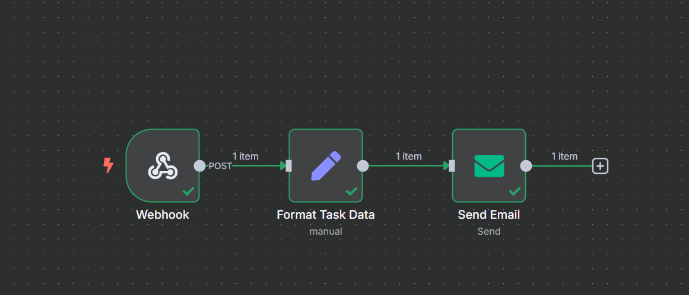

# Task Manager with n8n Email Automation

A **basic full-stack MERN project** with email notifications using **n8n workflow automation**. This project demonstrates **task creation, completion, and automated email notification** using a self-hosted n8n instance.

* * *

## Features

*   **User authentication** (via JWT or local auth)
    
*   **Task CRUD** (Create, Read, Update, Delete)
    
*   **Email notification** when a task is marked as completed
    
*   **n8n self-hosted workflow** triggers automatically via webhook
  ## Tech Stack

*   **Frontend:** React.js
    
*   **Backend:** Node.js + Express.js
    
*   **Database:** MongoDB Atlas
    
*   **Automation:** n8n (self-hosted)
    
*   **Email Service:** Zoho SMTP
    

* * *

## Workflow Overview

The current workflow includes:

1.  **Webhook Node**
    
    *   Receives POST requests from backend when a task is marked completed.
        
2.  **Set Node**
    
    *   Formats the incoming task data (`taskTitle`, `userId`) to prepare for email.
        
3.  **Email Node**
    
    *   Sends a notification email to the user using Zoho SMTP.
  

